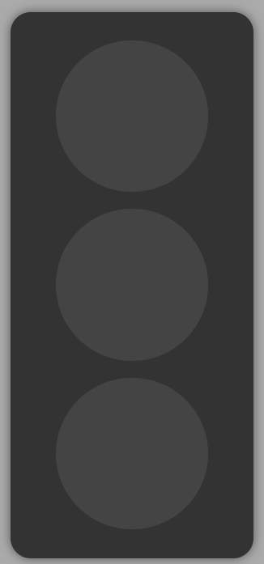
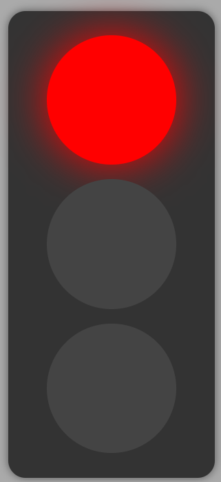
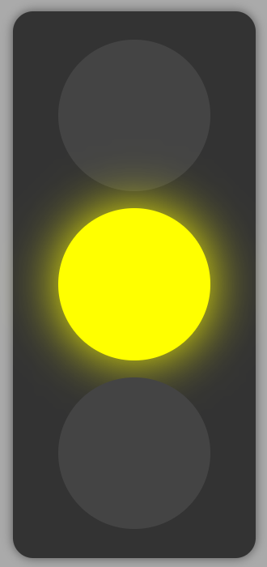
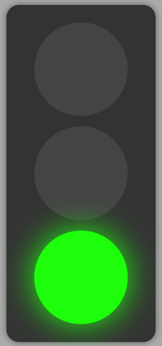

## Traffic light

The Traffic Light project is a simple application to change colors on traffic light by clicking.

### Screenshots







### Technologies Used

- **HTML**
- **CSS**
- **JavaScript**

### Clone the Repository

```bash
git clone https://github.com/Roman-Manzhelii/traffic_light.git
cd traffic_light
```

### Usage

Opening HTML in a Browser:<br>
If you're using _**Visual Studio Code**_, install the _**Live Server**_ extension:

Open the Extensions view in _**VS Code**_ (press _**Ctrl + Shift + X**_).<br>
Search for _**Live Server**_ and click **_"Install"_**.<br>
After installation, right-click on the **_HTML_** file and choose the option **_"Open with Live Server"_**. The **_HTML_** file will automatically open in your browser.<br>
If you already have the extension configured, a button to open the file in the browser may appear in the top-right corner of the editor.

Alternative method: You can also simply double-click on the **_HTML_** file in your file system, and it will open in your default browser.
